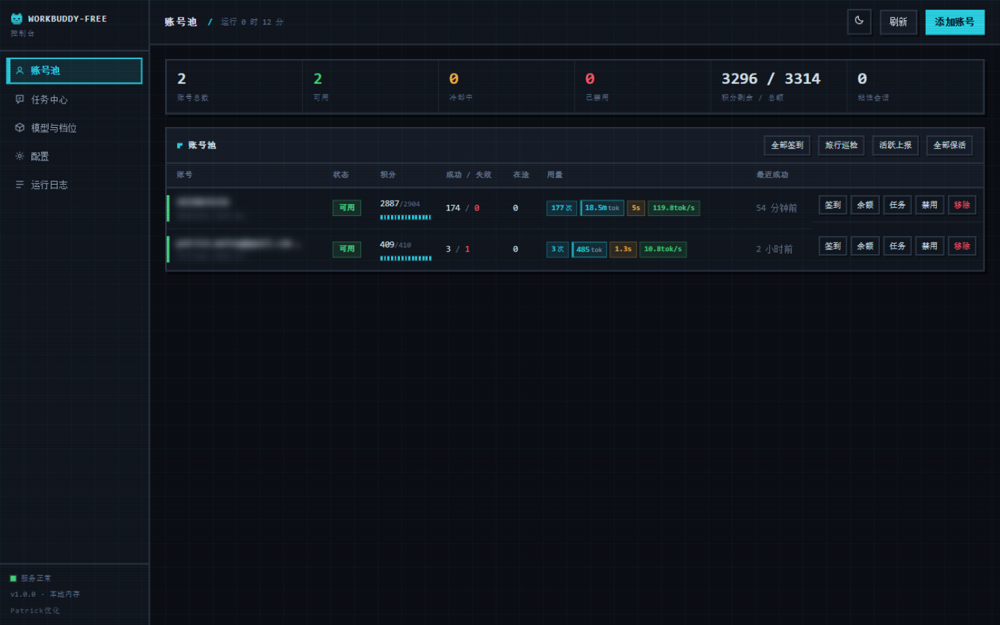
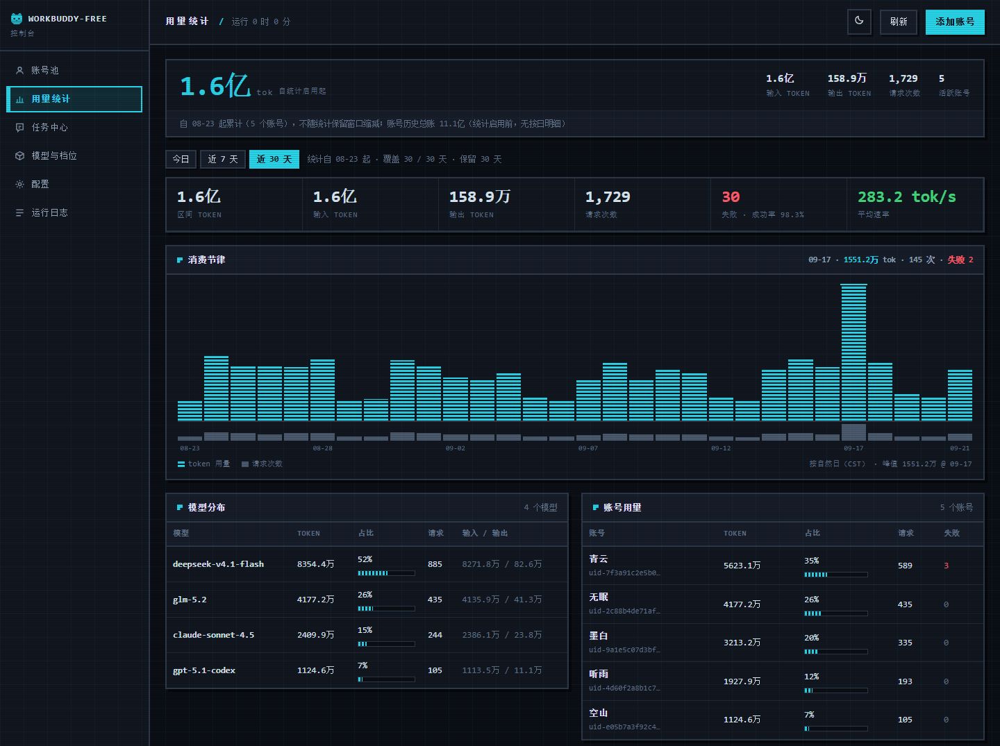
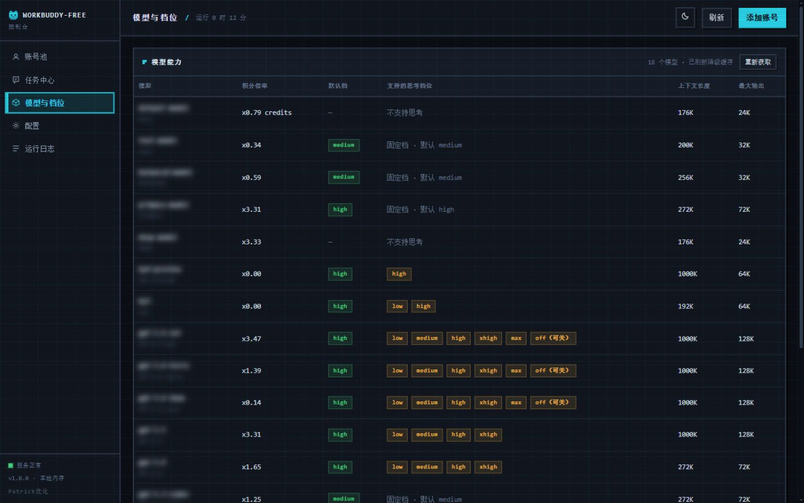
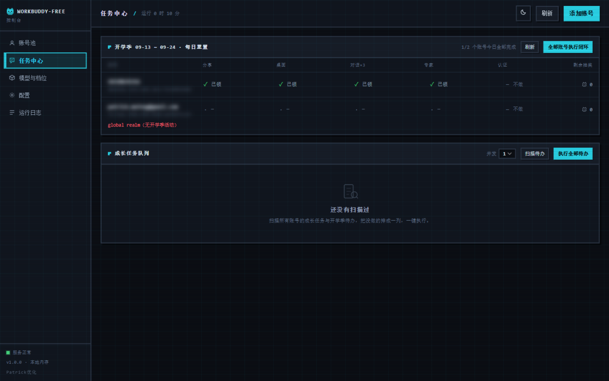
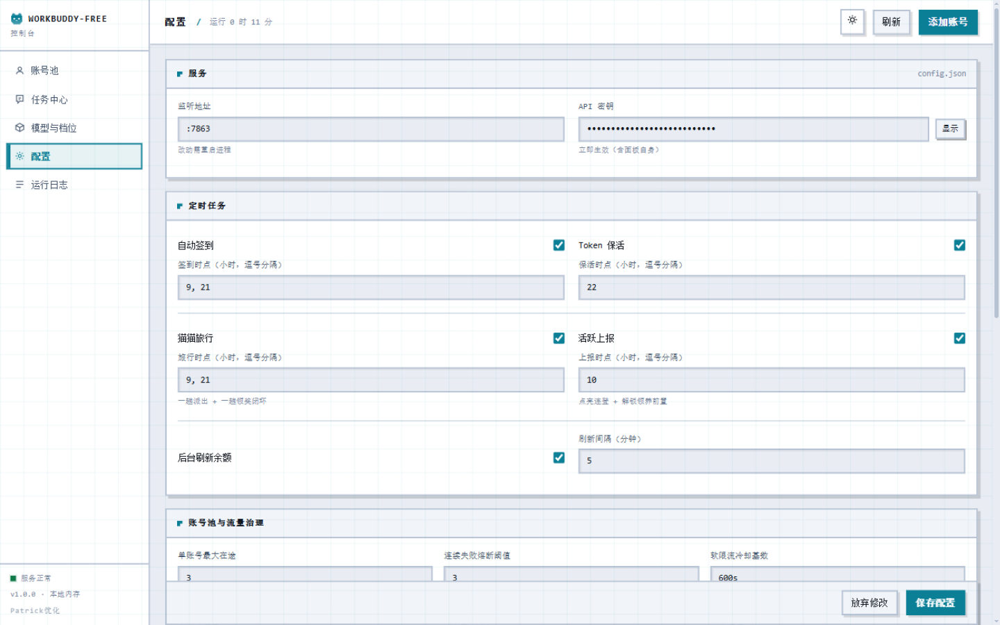
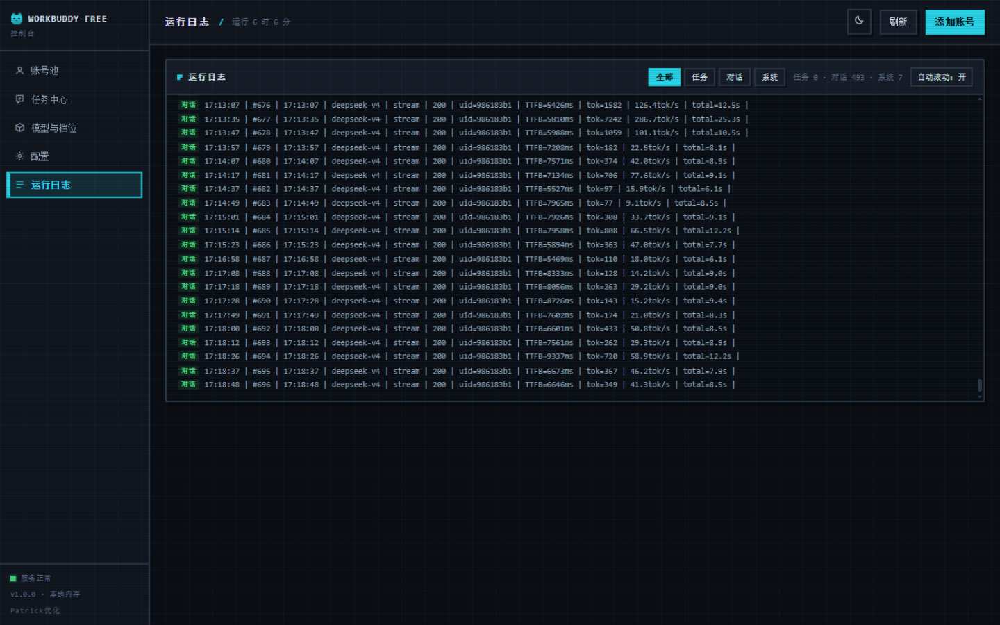
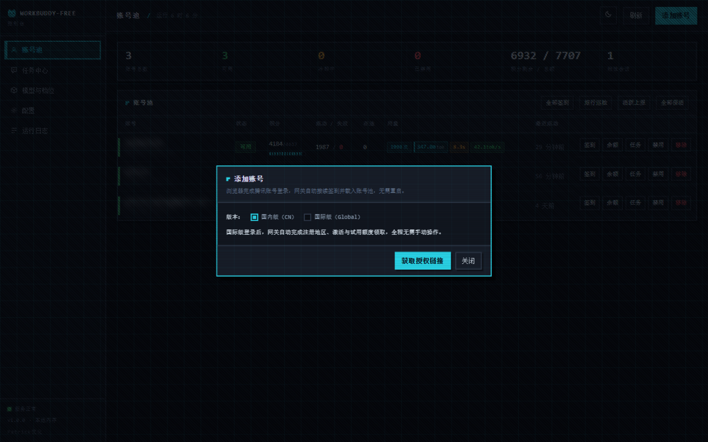

<p align="center">
  
</p>

<h1 align="center">workbuddy-free</h1>

<p align="center">
  <b>把腾讯 WorkBuddy 账号变成 OpenAI 兼容 API 的多账号网关 · 自带 Web 管理面板</b>
</p>

<p align="center">
  <a href="https://github.com/Patrick-mufeng/workbuddy-free/releases/latest"></a>
  
  
  
  
  
</p>

<p align="center">
  <a href="https://github.com/Patrick-mufeng/workbuddy-free/releases/latest"><b>⬇️ 下载最新版本</b></a>
  &nbsp;·&nbsp;
  <a href="#快速开始">快速开始</a>
  &nbsp;·&nbsp;
  <a href="#接入其他-agent">接入其他 Agent</a>
  &nbsp;·&nbsp;
  <a href="#界面预览">界面预览</a>
</p>

<p align="center">
  
</p>

---

## 这是什么

`workbuddy-free` 是一个自托管的 **OpenAI 兼容反向代理网关**，把腾讯 WorkBuddy（`copilot.tencent.com`）账号包装成标准的 `/v1/chat/completions` 服务，并配一套内嵌的 Web 运维面板。

官方不提供 OpenAI 形态的开放 API。本项目通过 **OAuth 设备授权**获取账号凭证，在网关侧完成 token 自动刷新、账号池调度与流量治理，对客户端只暴露 OpenAI 接口——**现有 SDK、前端、CLI 工具零改造接入**。

面向**个人多账号**场景：多账号共享、单号故障自动换号、冷却与熔断防止雪崩、会话粘性保证多轮上下文不跳号。

> ⚠️ **合规须知**：本项目是**非官方**网关，使用 WorkBuddy 账号作为上游，**仅限本人授权账号、本机 / 私有环境测试**。详细边界见[安全与合规](#安全与合规)。

## 核心能力

| 能力 | 说明 |
|---|---|
| 🔑 **OAuth 一键登录** | 面板「添加账号」或 `login.sh` 完成设备授权，凭证自动落盘并**热加载进池（免重启）** |
| 🔄 **多账号池** | 三因子加权随机选号（积分占比 ×10 + 闲置补偿 + 成功率 ×3），Top-5 候选 + 防惊群 |
| 🛡️ **熔断与冷却** | 429 软冷却 600s 起指数退避、404 固定 60s、402 硬冷却至次日 04:00、连续失败熔断、在途租约限流 |
| 🧲 **会话粘性** | 同一会话尽量绑定同一账号，TTL 滚动续期，失败自动解绑；可镜像 Redis 防重启丢失 |
| ⏰ **定时任务** | 签到（9/21 点）· 活跃上报（10 点）· 猫猫旅行（9/21 点）· token 保活（22 点）· 夜猫子（23 点），五类独立开关 |
| 🎯 **成长任务** | 官方成长计划 18 个任务中 **17 个可在面板一键纯 API 完成**，自动推进进度并领奖 |
| ⚡ **流式 + 非流式** | 出站强制 `stream:true`；SSE 帧按规范白名单重建；非流式由本地聚合为单响应 |
| 🧠 **推理模型兼容** | DeepSeek 思维链注入、`reasoning_content` 多轮回填、思考档位自动降级 |
| 💬 **系统提示词体系** | 网关自有提示词替换客户端 system（`custom` 模式），从源头消灭 system 来源的内容误报 |
| 🗑️ **指纹脱敏** | 出站请求体黑名单指纹字段清洗，与提示词体系两层叠加 |
| 📊 **可观测** | 每请求一行表格日志（TTFB / token 速率 / uid）；`/healthz` 带 `service` 身份标识可接负载均衡探活 |
| 📈 **用量统计** | token 按自然日 / 模型 / 账号 / 小时聚合，面板出趋势图与排行；窗口可配、可整体关闭 |
| 💾 **状态持久化** | 池状态本地原子落盘 + Upstash Redis 异步镜像（可选），重启择新恢复 |

## 界面预览

### 账号池

统计条 + 账号表：状态标签（可用 / 限流冷却 / 积分冷却 / 熔断 / 已禁用）、积分量条、成功失败计数、在途数、单号操作与批量任务。


### 用量统计

按自然日（CST）聚合每次请求的 token 用量。顶部是**自统计启用起**的累计（与下方时间序列同一个聚合器，所以上下永远自洽，且不随保留窗口缩减），下方是**区间口径**（今日 / 近 7 天 / 近 30 天）的观测条、消费节律图与模型 / 账号排行。数量级一律用中文单位（万 / 亿 / 万亿）。

消费节律图一根柱一天（今日视图按小时），柱高是 token 用量、柱下一行细条是请求次数——同一时间轴上的两个变量，一眼能看出用量是"少数大请求"还是"大量小请求"堆出来的。悬停或键盘聚焦某根柱，右上角读数槽给出该点明细。排行表的占比条与账号表的积分量条同一套纹理。



统计按天聚合后落盘（默认 `data/stats.json`，保留 30 天，可在配置页调整或整体关闭），内存与文件体积随"保留天数 × 模型数"有界，不会像请求日志那样无界增长；头条的累计总账单独记一份、不随窗口淘汰，窗口滚掉的老日子仍计在里面。

头条脚注里的**账号历史总账**取自池内各账号的长期累加，从账号第一次请求起就在涨，**早于本功能存在**——它只有总数、没有按日明细，无法回填到时间轴上，因此只作参照列出，不是头条口径。

### 模型与档位

实时查询上游：每个模型的积分倍率、默认思考档、支持的档位、上下文长度与最大输出。



### 任务中心

全账号任务扫描 + 执行队列（账号内串行、账号间可选并发），执行进度实时回填；开学季活动独立状态卡。



### 配置（浅色主题）

在线编辑 `config.json`，涉及运行期的字段**保存即生效**；面板支持明暗两套主题，首次访问跟随系统偏好。



### 运行日志

按「任务 / 对话 / 系统」分频道筛选；对话频道是请求级日志，每条一行带 TTFB 与 token 速率：



## 快速开始

### 环境要求

- **单文件二进制**（推荐）：Windows / macOS / Linux 直接下载运行，**无需 Docker、无需 Go**
- **Docker + Docker Compose**（服务端部署，镜像内已含低权限用户与全部工具脚本），**或**
- 从源码构建：宿主机 Go ≥ 1.22
- 一个或多个已注册的 WorkBuddy 账号

### 方式一：下载预编译二进制（最省事）

到 [**Releases**](https://github.com/Patrick-mufeng/workbuddy-free/releases/latest) 下载对应平台的压缩包：

| 平台 | 文件 |
|---|---|
| Windows 64 位 | `workbuddy-free_<版本>_windows_amd64.zip` |
| Linux x86_64 | `workbuddy-free_<版本>_linux_amd64.tar.gz` |
| Linux ARM64 | `workbuddy-free_<版本>_linux_arm64.tar.gz` |
| macOS Apple Silicon | `workbuddy-free_<版本>_darwin_arm64.tar.gz` |
| macOS Intel | `workbuddy-free_<版本>_darwin_amd64.tar.gz` |

解压后**直接运行主程序即可**，无需任何依赖：

```bash
# Windows
.\wb2api.exe -config config.json

# Linux / macOS
./wb2api -config config.json
```

首次启动会在当前目录**自动生成 `config.json`**（含随机 `api_key`，日志打印一次），随后浏览器打开 <http://127.0.0.1:7863/panel/> 添加账号。

各包内容：

- **Windows**：`wb2api.exe` 主程序 + `login.exe` / `signin.exe` / `credit.exe` / `trial.exe` 工具 + `config.example.json`
- **Linux / macOS**：`wb2api` 主程序 + `login` / `signin_bin` / `credit` / `trial` 工具 + `login.sh` / `signin.sh` / `credit.sh` 脚本 + `config.example.json`

> 压缩包均附 `SHA256SUMS.txt` 校验文件，可用 `sha256sum -c SHA256SUMS.txt` 验证完整性。
> 二进制为 `CGO_ENABLED=0` 静态构建，解压即用，不依赖系统库。

### 方式二：Docker Compose

```bash
git clone https://github.com/Patrick-mufeng/workbuddy-free.git
cd workbuddy-free

# 准备配置（compose 挂载此文件，缺失会导致容器启动失败）
cp config.example.json config.json

# 启动（首次会构建镜像，约 1-2 分钟）
docker compose up -d --build

# 健康检查（无可用账号时返回 503）
curl -s http://localhost:7863/healthz
# {"healthy":0,"total":0,"service":"workbuddy-free"}
```

启动后打开 **`http://localhost:7863/panel/`**，用面板「添加账号」完成登录。

常用运维命令：

```bash
docker compose logs -f     # 跟踪日志
docker compose restart     # 重启
docker compose down        # 停止并移除容器（数据在 ./auths 与 ./data，不受影响）
```

> **挂载目录属主问题**：容器默认以 uid 10001 运行，宿主机挂载目录属主不符会报
> `写入 auths/*.json.tmp 失败： permission denied`。解法（任选其一）：
> `PUID=$(id -u) PGID=$(id -g) docker compose up -d`（推荐，非 root）·
> `sudo chown -R 10001:10001 ./auths ./data ./config.json` ·
> compose 里设 `user: "0:0"`（省事但容器逃逸面更大）。

### 方式三：从源码构建（开发调试）

```bash
go build ./...                     # 编译检查
go vet ./...                       # 静态检查
go test ./...                      # 完整测试套件
go run ./cmd/server -config config.json
```

构建单文件二进制：

```bash
CGO_ENABLED=0 go build -trimpath -ldflags="-s -w" -o wb2api.exe ./cmd/server   # Windows
CGO_ENABLED=0 go build -trimpath -ldflags="-s -w" -o wb2api     ./cmd/server   # Linux / macOS

# 工具（可选）
CGO_ENABLED=0 go build -trimpath -ldflags="-s -w" -o login      ./cmd/login
CGO_ENABLED=0 go build -trimpath -ldflags="-s -w" -o signin_bin ./cmd/signin
CGO_ENABLED=0 go build -trimpath -ldflags="-s -w" -o credit     ./cmd/credit
```

交叉编译其他平台（Go 原生支持，无需额外工具链）：

```bash
CGO_ENABLED=0 GOOS=linux  GOARCH=amd64 go build -trimpath -ldflags="-s -w" -o wb2api-linux-amd64  ./cmd/server
CGO_ENABLED=0 GOOS=linux  GOARCH=arm64 go build -trimpath -ldflags="-s -w" -o wb2api-linux-arm64  ./cmd/server
CGO_ENABLED=0 GOOS=darwin GOARCH=arm64 go build -trimpath -ldflags="-s -w" -o wb2api-darwin-arm64 ./cmd/server
```

构建产物为**单文件自包含**（前端资源已 embed 进二进制），拷到任意机器即可运行，只需保证 `auths/`（凭证）与 `data/`（状态）目录可写。

仓库自带两个 Windows 辅助脚本（含本机路径，已被 `.gitignore` 排除）：

| 脚本 | 作用 |
|---|---|
| `start-gateway.bat` | 双击启动：后台常驻、自动健康检查、日志落 `data/wb2api.log` |
| `stop-gateway.bat` | 双击停止 |

### 添加账号

**方式 A：Web 面板（推荐，各平台通用）**

打开 `http://127.0.0.1:7863/panel/`，点右上角「**添加账号**」：面板展示授权链接 → 浏览器完成登录 → 自动检测并落盘凭证 → **热加载进池（无需重启）**，顺带完成首次签到。支持国内版（CN）与国际版（Global）两种账号。



> **凭证文件名的约定**：落盘文件是 `auths/workbuddy-<uid>.json`。这个前缀是对接上游的固定约定，**不要改名**，改了网关会读不到账号。

**方式 B：命令行脚本（仅 Linux / macOS，依赖 bash + python3）**

```bash
./login.sh
# 按提示在浏览器打开授权链接 → 回到终端确认 → 凭证落盘 auths/workbuddy-<uid>.json
```

> Windows 用户请用方式 A（或 WSL）。

### 验证

```bash
# 模型列表
curl -s http://localhost:7863/v1/models -H "Authorization: Bearer your-api-key"

# 账号状态（汇总 + 每账号详情）
curl -s http://localhost:7863/status  -H "Authorization: Bearer your-api-key"

# 流式聊天
curl -sN http://localhost:7863/v1/chat/completions \
  -H "Authorization: Bearer your-api-key" \
  -H "Content-Type: application/json" \
  -d '{"model":"cn:glm-5.2","messages":[{"role":"user","content":"hi"}],"stream":true}'

# 非流式聊天（本地聚合）
curl -s http://localhost:7863/v1/chat/completions \
  -H "Authorization: Bearer your-api-key" \
  -H "Content-Type: application/json" \
  -d '{"model":"cn:glm-5.2","messages":[{"role":"user","content":"hi"}],"stream":false}'
```

> **模型名带域前缀**：`cn:<模型名>` 路由到国内版账号，`global:<模型名>` 路由到国际版账号。
> 不带前缀的裸名默认按 `cn` 处理。两个域的模型清单不重叠，填错域会被上游拒绝。
> 用 `/v1/models` 取完整清单。

## 接入其他 Agent

网关对客户端只暴露标准 OpenAI 接口，因此**任何支持 OpenAI 协议的客户端都能直接接入**，无需改造。

### 接入三要素

| 要素 | 填什么 | 从哪拿 |
|---|---|---|
| **接口地址** | `http://<网关地址>:7863/v1` | 网关所在机器 IP，本机即 `127.0.0.1` |
| **API 密钥** | `sk-...` | 面板「配置」页的 **API 密钥** 字段，或 `config.json` 的 `api_key` |
| **模型名** | `cn:glm-5.2` 等 | 面板「模型与档位」页第一列，或 `GET /v1/models` |

面板「配置」页的 **API 密钥**（默认掩码，点右侧「显示」可明文查看）：


面板「模型与档位」页第一列就是可用的模型名：


### 填写方式

各客户端的菜单名称不同，但需要填的都是同一组字段。找到「添加模型服务 / Provider」入口：

| 字段（各家叫法略不同） | 填什么 |
|---|---|
| 类型 / Provider / 接口格式 | **OpenAI 兼容 / OpenAI Compatible** |
| 接口地址 / Base URL / API 地址 | `http://<网关地址>:7863/v1` |
| API Key / 密钥 | 上一步拿到的 `sk-...` |
| 模型名 / Model | `cn:glm-5.2` 这样带前缀的名字 |

常见客户端的「类型」该选什么：

| 客户端 | 选什么 |
|---|---|
| Cherry Studio / ChatBox / NextChat / LobeChat / Open WebUI | OpenAI（或「OpenAI 兼容」） |
| Cline / Roo Code / Continue（VS Code 插件） | OpenAI Compatible |
| Dify / One API / New API | OpenAI-API-compatible |
| **Codex** | 需把 provider 的 `wire_api` 设为 `chat` |
| **Claude Code** | ⚠️ 不支持直连（见下方速查表） |

#### 示例：ZCode

配置位于 `~/.zcode/v2/config.json`：

```jsonc
{
  "provider": {
    "<自动生成的 UUID>": {
      "name": "workbuddy",
      "kind": "openai-compatible",              // ⚠️ 必须是 openai-compatible
      "options": {
        "apiKey": "sk-你的密钥",
        "baseURL": "http://127.0.0.1:7863/v1",  // ⚠️ 必须带 /v1
        "apiKeyRequired": true
      },
      "models": {
        "cn:glm-5.2": {
          "limit": { "context": 1000000, "output": 131072 },
          "modalities": { "input": ["text"], "output": ["text"] }
        }
      }
    }
  }
}
```

**两个必须注意的地方**（写错任意一处都连不上）：

- `kind` 必须是 `openai-compatible`。填成 `openai` 会走 **Responses 协议**（请求 `/v1/responses`），本网关未实现该端点，必定失败。
- `baseURL` 必须带 `/v1` 后缀。少了它请求会落到 `/chat/completions`，同样是 404。

### 验证接入是否成功

**先用 curl 打通，再配客户端**——这样能一步区分「网关问题」还是「客户端配置问题」：

```bash
curl -s http://127.0.0.1:7863/v1/chat/completions \
  -H "Authorization: Bearer sk-你的密钥" \
  -H "Content-Type: application/json" \
  -d '{"model":"cn:glm-5.2","messages":[{"role":"user","content":"hi"}],"stream":false}'
```

返回标准 OpenAI 格式 JSON（含 `choices[0].message.content`）即网关正常。

**第二步**：在客户端发一条消息，再看面板「运行日志」有没有新增请求行、状态码是否为 200：

```text
| #205 | 14:14:44 | deepseek-v4 | stream | 200 | uid=········ | TTFB=3428ms | tok=104 | 27.2tok/s | total=3.8s |
```

> **高效排查技巧**：在客户端发请求后——
> - **日志没有新增行** → 请求根本没到网关，问题在网络或地址（注意客户端是否跑在 WSL / Docker / 另一台机器里，那样 `127.0.0.1` 指向的不是宿主机）
> - **有新增行但状态码非 200** → 问题在模型名或账号侧

### 常见错误速查

| 现象 | 原因 | 解决 |
|---|---|---|
| `404` | Base URL 少了 `/v1`，客户端又自己补一次，变成 `/v1/v1/...` | Base URL 填 `http://<host>:7863/v1` |
| `404` | 用了 Anthropic 协议（`/v1/messages`） | Claude Code 不支持直连，需 OpenAI→Anthropic 转换代理 |
| `404` | 用了 Responses 协议（`/v1/responses`） | Codex 需把 `wire_api` 设为 `chat` |
| `401` | API 密钥不对 | 从面板「配置」页或 `config.json` 重新复制 |
| 模型不可用 | 模型名不属于该域 | 加对 `cn:` / `global:` 前缀 |
| 连不上 | 客户端在 WSL / 容器 / 另一台机器 | `127.0.0.1` 换成网关机器的局域网 IP |
| `413` | 请求体超过 8 MB（多图 / 超长上下文） | 调大 `server.max_body_mb` |

## 配置说明

**`config.example.json` 是配置项最完整的参考**：每个字段、默认值与结构都能在其中找到，示例值一律是 `test_key` 之类占位符，**不含任何真实密钥**。

### 字段速查

| 字段 | 默认 | 说明 |
|---|---|---|
| `listen` | `:7863` | HTTP 监听地址 |
| `api_key` | 空 | 网关鉴权密钥；**空 = 不鉴权直接放行**（公网必须设置） |
| `auth_dir` | `./auths` | 账号凭证目录 |
| `state_file` | `./data/state.json` | 账号池状态持久化文件 |
| `server.max_body_mb` | `8` | 聊天请求体大小上限（MB）。超限直接返回 **413 `request_body_too_large`** |
| `cooldown.soft_rate` | `600s` | 软限流冷却基数；同一账号连续触发按 2 倍指数退避 |
| `cooldown.soft_rate_max` | `2h` | 软冷却指数退避封顶 |
| `schedule.checkin_hours` | `[9, 21]` | 签到 + 余额查询解冻时点 |
| `schedule.travel_hours` | `[9, 21]` | 猫猫旅行状态机推进时点 |
| `schedule.activity_hours` | `[10]` | 对话活跃上报时点 |
| `schedule.keepalive_hours` | `[22]` | token 保活时点 |
| `schedule.blackcat_hours` | `[23]` | 夜猫子补足时点（23:00–08:00 计数窗口） |
| `schedule.*_enabled` | `true` | 五类定时任务各自的总开关 |
| `upstream.timeout_seconds` | `120` | 短 RPC（刷新 / 签到 / 余额 / 模型列表）总时长上限 |
| `upstream.header_timeout_seconds` | 回落 `timeout_seconds` | 聊天首字节前（响应头）上限 |
| `upstream.idle_timeout_seconds` | `300` | 聊天流中空闲上限（活跃续命，静默断流） |
| `upstream.user_agent` | 空 | 出站 UA 覆盖（影响官网积分记录「使用端」显示） |
| `features.sanitize_blacklist_fingerprints` | `true` | 出站请求体黑名单指纹脱敏 |
| `prompt.mode` | `passthrough` | `passthrough` = 透传客户端原始 system；`custom` = 网关自有提示词替换客户端 system |
| `prompt.file` | 空 | 提示词文件路径；空 = 内置默认；路径非空但不可读 → 启动报错 |
| `upstash.url` / `upstash.token` | 空 | 空 = 纯内存模式（Noop 降级，功能照常） |
| `pool.max_in_flight` | `3` | 单账号最大在途请求数（`0` = 不限） |
| `pool.breaker_threshold` | `3` | 连续失败触发熔断阈值 |
| `pool.breaker_cooldown` | `30m` | 熔断基础退避时长（封顶 `breaker_cooldown_max`） |
| `pool.idle_weight_per_hour` | `0.5` | 闲置补偿：每小时未使用 +0.5 权重 |
| `session_sticky.enabled` | `true` | 会话粘性路由开关 |
| `session_sticky.ttl` | `30m` | 会话绑定 TTL（滚动续期） |

### 上游超时语义

| 字段 | 作用对象 | 默认 | 行为 |
|---|---|---|---|
| `timeout_seconds` | 短 RPC（token 刷新 / 签到 / 余额 / 模型列表） | `120` | 总时长硬上限，到期报错走换号 / 熔断 |
| `header_timeout_seconds` | 聊天 SSE **首字节前** | `120` | 超时 = 换号重发 |
| `idle_timeout_seconds` | 聊天 SSE **流中空闲** | `300` | 活跃吐数据续命不掐；静默超时才断流释放租约 |

聊天流（`stream` true / false 均同）**没有总时长上限**：长思考 / 长输出不会被掐断。

### 环境变量覆盖

加载顺序：JSON 文件 → `WB2A_*` 环境变量（变量非空才覆盖）。共 22 个：

**服务与存储**
`WB2A_LISTEN` · `WB2A_API_KEY` · `WB2A_AUTH_DIR` · `WB2A_STATE_FILE` · `WB2A_MAX_BODY_MB`

**冷却与超时**
`WB2A_SOFT_RATE`(duration) · `WB2A_SOFT_RATE_MAX`(duration) · `WB2A_TIMEOUT_SECONDS` · `WB2A_HEADER_TIMEOUT_SECONDS` · `WB2A_IDLE_TIMEOUT_SECONDS` · `WB2A_EXPIRING_SOON`

**出站身份与指纹**
`WB2A_USER_AGENT` · `WB2A_CLIENT_VERSION` · `WB2A_CLI_VERSION` · `WB2A_CLIENT_NAME` · `WB2A_DEVICE_TOKEN` · `WB2A_DEVICE_TOKEN_FILE` · `WB2A_PASSTHROUGH_IP`

**提示词与脱敏**
`WB2A_SANITIZE_FINGERPRINTS`(bool) · `WB2A_PROMPT_MODE` · `WB2A_PROMPT_FILE`

**调试**
`WB2A_DEBUG_CHAT`（仅调试用，未在面板暴露）

## 核心行为语义

### 系统提示词体系

客户端（Claude Code / Codex 等 CLI）会在 system prompt 注入固定模板句，上游内容审核按**逐字精确匹配**误杀合法流量（HTTP 400 + 审核文案）。网关提供两层防护，互不替代：

1. **提示词体系**（解决 **system / developer 来源**的误报）：由 `prompt.mode` 控制
2. **指纹脱敏**（兜底 **用户 / assistant 消息**里的指纹串）：由 `features.sanitize_blacklist_fingerprints` 控制

| 模式 | 语义 |
|---|---|
| `passthrough`（默认） | 透传客户端原始 system，不做改写 |
| `custom` | 出站前用网关自有提示词**替换**客户端 system / developer 消息；user / assistant / tool 消息逐字不动 |

内置默认提示词约 2KB（`internal/prompt/defaultprompt.md`，嵌入二进制）。`prompt.file` 指向自定义提示词文件即整体替换内置默认。

### 内容拦截误报与降级重试

`passthrough` 模式下请求被上游内容策略拦截（HTTP 400 + `blocked by security policy` / `unapproved channel` / `illegal api invocation` 文案）时，判定为 system 指纹误报：**同请求内**换 Degraded 中性提示词重试一次；第二次仍被拦则走既有错误路径返回客户端。

- 触发降级后持续到**次日 00:00 CST** 重置；降级期内 `passthrough` 请求直达中性提示词
- 降级状态是**进程内存态**，重启清零
- 内容问题非账号问题：不罚账号（无冷却 / 熔断 / 计错）

### 错误分类与账号处置

上游错误统一分类（判定优先级：余额耗尽 → session 失效 → 限流文案 → 状态码兜底）：

| 分类 | 触发条件 | 账号处置 | 恢复 |
|---|---|---|---|
| 余额不足 | HTTP 402 / body 含余额关键词 | 硬冷却到**次日 04:00** | 签到（9/21 点）余额恢复自动解冻 |
| 频控 | HTTP 429 / 限流文案 | 软冷却 `soft_rate`（600s 起指数退避，封顶 `soft_rate_max`） | 到期自动恢复 / 成功清零退避 |
| Session 失效 | body 含 `Offline user session not found` / `12153` | **连续 3 次**才永久禁用 | 人工重新登录或 `ReviveDisabled` 复活 |
| 上游 404 | HTTP 404 | 软冷却固定 60s | 到期自动恢复 |
| 服务端错误 | HTTP ≥500 | 喂连续失败计数，达阈值熔断 | 熔断到期 / 成功清零 |
| 请求体解析失败 | HTTP 400 + `Unmarshal chat params failed` / `11101` | **不罚账号，但仍轮转** | 即时 |
| 内容拦截 | HTTP 400 + 审核文案 | **不罚账号**，走降级重试 | 即时 |

**熔断器**：所有冷却入口与 5xx 共用唯一连续失败计数器 `fails`；累计达 `breaker_threshold`（默认 3）触发熔断，退避 `breaker_cooldown × 2^retryCount`，封顶 `6h`；成功清零。

### 选号策略

1. 过滤：禁用 / 冷却 / 熔断 / 在途占满账号不参与
2. 取 **Top-5** 候选（按三因子权重降序）
3. 三因子加权随机：`weight = credits 比例 ×10 + idleWeight + successRate ×3`
4. 防惊群：跳过 100ms 内刚被选中的账号；全冷却时从非禁用、非余额耗尽的账号中选最早到期者顶班

### 会话粘性

- 会话键提取顺序：`metadata.conversation_id` → `metadata.conversationId` → `metadata.user_id` → 顶层同名键
- 客户端不发会话键时，用 `system + 首条 user` 哈希派生（`d-` 前缀），通用 OpenAI 客户端也能享受粘性
- TTL 滚动续期（默认 30m），GC 周期 5m；绑定可镜像到 Redis（7 天 TTL）防重启丢失
- 请求失败自动解绑；成功后绑定跟随最终成功账号

### 定时任务

五类任务各自独立排程、各有开关。容器时区由 `TZ` 控制（compose 默认 `Asia/Shanghai`）。

| 任务 | 开关（默认 true） | 时刻（默认） | 行为 |
|---|---|---|---|
| 签到 | `schedule.checkin_enabled` | `[9, 21]` 整点 | 签到 + 余额查询；余额恢复则解冻冷却账号。末尾追加连登管家 |
| 活跃上报 | `schedule.activity_enabled` | `[10]` 整点 | 对话活跃上报；点亮连登 + 解锁领养前置 |
| 猫猫旅行 | `schedule.travel_enabled` | `[9, 21]` 整点 | 独立排程：无猫领养 / 派出 / 领奖 |
| 保活 | `schedule.keepalive_enabled` | `[22]` 整点 | 全账号刷新 token |
| 夜猫子 | `schedule.blackcat_enabled` | `[23]` 整点 | 先查任务进度，未达标才在夜间窗口补足 |

> **关闭语义**：用 `schedule.*_enabled: false` 显式关闭。注意 `*_hours` 设成**空数组或 `null`
> 表示「未配置 → 回落默认」，不是「禁用」**；真正关闭请用 `*_enabled: false`。
> 关签到会把「余额恢复即解冻」一起关掉。

## API 端点

| 端点 | 鉴权 | 说明 |
|---|---|---|
| `POST /v1/chat/completions` | Bearer（`api_key` 非空时） | OpenAI 兼容补全；流式 / 非流式；请求体上限 8 MiB |
| `GET /v1/models` | Bearer（`api_key` 非空时） | 模型列表（动态拉取，缓存 1h；失败回落静态表）；带 `supported_efforts` / `default_effort` 等上游真实字段 |
| `GET /status` | Bearer（`api_key` 非空时） | 账号状态汇总 + 每账号详情 |
| `GET /healthz` | 无 | 健康检查：有可用账号返回 200，否则 503 |

> **鉴权规则**：仅当 `api_key` 非空才校验 `Authorization: Bearer <api_key>`；**`api_key` 为空时上述端点直接放行**；`/healthz` 恒无鉴权。

### 流式行为细节

- 出站请求强制 `stream:true`；SSE 帧按 OpenAI 规范**白名单重建**（`reasoning_content` 保留、工具调用按 index 合并、未知字段剥离）
- 保证恰好一个 `data: [DONE]`（上游漏发时兜底补写）；空流先写一帧 `error` 再补 `[DONE]`
- 非流式请求由本地聚合完整 SSE 流为单 `chat.completion` 响应

### 宿主健康探测

`/healthz` 响应带身份标识，用于区分**本网关**与同端口上可能残留的其他服务——对方即使返回 2xx 也不带该字段 / 头：

```json
{"healthy": 2, "total": 3, "service": "workbuddy-free"}
```

响应同时带 `X-Service: workbuddy-free` 头。

- **强校验（推荐）**：`/status` + `api_key`，只有持有正确密钥的本网关返回 200
- **弱校验（不适合持 key 的负载均衡器）**：`/healthz` + `service == "workbuddy-free"` 判据

## Web 管理面板

内嵌式面板（前端 go:embed 单文件打进二进制，无外部构建依赖），服务启动后访问 `http://127.0.0.1:7863/panel/`。

鉴权与 API 同口径：`api_key` 非空时面板要求输入一次密钥（浏览器 localStorage 记住）。界面支持**明暗主题切换**，左侧导航分五个视图：

| 视图 | 功能 |
|---|---|
| **账号池** | 统计条 + 账号表：状态标签、积分量条、成功失败计数、在途、单号操作（签到 / 余额 / 任务 / 解冻 / 禁用 / 移除）；批量「全部签到」「旅行巡检」「活跃上报」「全部保活」 |
| **任务中心** | 全账号任务扫描 + 执行队列（账号内串行，账号间可选并发 1-3）；开学季活动状态矩阵 |
| **模型与档位** | 实时查询上游：积分倍率、默认思考档、支持档位、上下文长度、最大输出 |
| **配置** | 在线编辑 `config.json`，含定时任务、账号池与流量治理参数、上游超时与 UA、提示词模式、脱敏与粘性开关 |
| **运行日志** | 最近 500 行服务日志 + 请求表格日志（按任务 / 对话 / 系统分频道，可开关自动滚动） |

几个实用细节：

- **账号色条**：绿 = 可用，黄 = 冷却中，红 = 已禁用。卡在冷却的账号点行内「解冻」即可恢复。
- **请求日志格式**：
  ```text
  | #204 | 14:14:32 | deepseek-v4 | stream | 200 | uid=········ | TTFB=3495ms | tok=163 | 40.3tok/s | total=4.0s |
  ```
  `TTFB` 是流式首帧耗时（非流式为 `-`）。**TTFB 高说明上游出字慢，tok/s 低说明生成慢**，据此可快速判断瓶颈在哪。
- **任务队列**：点「扫描待办」拉取所有账号未完成的任务并排成一列，「执行全部待办」按账号串行执行，账号间可选并发 1-3，进度实时回填。

**配置热生效**：保存后 `api_key`、`cooldown.soft_rate`、脱敏开关、`pool.*`、`schedule.*` **立即生效**；涉及进程装配期的字段（`listen`、`auth_dir`、`state_file`、`upstream.*`、`upstash.*`、`session_sticky.ttl`）会提示「需重启进程生效」。写入采用「深合并且原子替换」，只更新表单覆盖的键，手写的未知键原样保留。

**安全响应头**：面板页面与全部 `/panel/api/*` 响应统一带 `Content-Security-Policy`（`default-src 'none'`、脚本仅同源、`frame-ancestors 'none'` 禁嵌套）、`X-Content-Type-Options: nosniff`、`X-Frame-Options: DENY`、`Referrer-Policy: no-referrer`。前端脚本独立为同源 `app.js`，不含内联脚本与内联事件处理器。

> ⚠️ **公网部署提示**：服务自身只提供明文 HTTP，**请务必置于 HTTPS 反向代理之后**（Nginx / Caddy 等）并配置访问限流；仅本机或私有网络使用可直接运行。

## 可观测

### 请求级日志

每个 `/v1/chat/completions` 请求结束时输出一行表格日志：

```text
| #001 | 18:31:31 | deepseek-v4 | stream | 200 | uid=0851ce35 | TTFB=801ms | tok=60 | 23.5tok/s | total=2.6s |
```

| 字段 | 说明 |
|---|---|
| `#001` | 进程级请求序号 |
| `18:31:31` | 结束时刻 |
| `deepseek-v4` | 模型名（超 11 字符截断） |
| `stream` / `sync` | 请求模式 |
| `200` | 状态码 |
| `uid=0851ce35` | 账号 UID 前 8 位 |
| `TTFB` | 流式首帧耗时（非流式为 `-`） |
| `tok` / `tok/s` / `total` | 输出 token 数 / 速率 / 总时长 |

**敏感度**：日志不含任何 token 明文，无落盘日志文件。

## 部署运维

### 工具脚本

| 脚本 | 用途 |
|---|---|
| `./login.sh` | OAuth 登录 → 落盘 auth → 重启容器 |
| `./signin.sh [auths_dir]` | 批量签到（过期先刷新） |
| `./credit.sh` / `./credit.sh -json` | 积分日报（美化 / 原始 JSON） |
| `python3 scripts/probe_active.py` | 活跃上报手动诊断 / 补跑（写操作默认 dry-run，需 `--yes`） |
| `start-gateway.bat` / `stop-gateway.bat` | Windows 本机启动 / 停止辅助 |

二进制不进版本库：**Release 压缩包已含全部二进制**；从仓库源码使用时，脚本会在首次运行自动 `go build` 对应 `cmd/*`（Docker 镜像内已预编译）。

### 账号管理

- 多账号复制 `auths/workbuddy-<uid>.json` 即可，池启动时自动对齐目录
- Session 失效账号被禁用（`disabled_reason` 透出在 `/status`）后，可用 `./login.sh` 重新登录覆盖凭证；已持久化的 `disabled=true` 可在源码侧调用 `Pool.ReviveDisabled(uid)` 复活
- 备份 = `auths/`（凭证）+ `data/state.json`（池状态）

## 安全与合规

### 凭据管理

- **位置**：`./auths`（`auth_dir` 可配），文件名 `workbuddy-<uid>.json`
- **内容**：明文 `accessToken` / `refreshToken` + 账号元信息
- **权限**：容器内以 `app` 用户（uid 10001）运行；token 刷新以 `0600` 原子写回；建议手动 `chmod 600 auths/*.json`
- **切勿提交 git**：`.gitignore` 已排除 `auths/`、`data/`、`backups/`、`config.json`、`*.key`、`*.pem`、`*.env`、`*.exe` 及除 README 外的全部 `*.md` 工作文档
- **⚠️ 分享 / 打包前自查**：`config.json`（含真实 `api_key`）、`auths/*.json`（含真实 token）、`data/state.json`（含 uid）三者即便已被 gitignore，仍可能被 `git add -f`、压缩包分享或截图带出

### 网络暴露与日志敏感度

- 默认监听 `:7863`，compose 暴露 `0.0.0.0:7863`，**无内置 TLS**
- 公网部署**必须**设置 `api_key`，建议前置反向代理 / 限制在内网
- 请求日志字段不含 `accessToken` / `refreshToken` / `api_key` 明文
- 日志写 **stdout / stderr**，代码无任何落盘日志文件

### 授权使用边界

- 仅限**本人授权账号**、本机 / 私有环境测试
- 不得共享、转售、违规分发，或用于违反目标平台条款的用途
- 遵守 WorkBuddy 平台服务条款与所在地法律
- 妥善保管 `auths/`（明文凭证）与网关端口

## 常见问题

### 模型名该带 `cn:` 还是 `global:`？

两个域的模型清单**不重叠**。`/v1/models` 会一次列出全部并带前缀：

- `cn:` —— 国内版账号，如 `cn:glm-5.2`、`cn:minimax-m3`、`cn:deepseek-v4.1-flash`
- `global:` —— 国际版账号，如 `global:fast-model`、`global:gpt-5.5`

裸模型名（不带前缀）按 `cn` 路由。若账号池里只有国际版账号，用裸名会失败，必须写 `global:`。

### 在第三方客户端里配置不成功？

最常见三个原因：

1. **Base URL 少了 `/v1`** —— 网关的路径是 `/v1/chat/completions`，Base URL 应填 `http://<host>:7863/v1`
2. **协议不匹配** —— 本网关只实现 OpenAI 的 `chat/completions`。Claude Code 的 Anthropic 协议（`/v1/messages`）与 Codex 默认的 Responses 协议（`/v1/responses`）都是 **404**；Codex 需把 provider 的 `wire_api` 设为 `chat`
3. **模型名不属于该域** —— 见上一条

### 429 code=6004（模型级限流）的冷却语义？

上游 `429` + `code 6004` 是**该模型的使用量超限**（msg 通常带「将在 YYYY-MM-DD HH:MM:SS UTC+8 重置」），不是账号整体被限流：

- **冷却到上游重置时间**，并封顶 `soft_rate_max`（默认 2h）
- **切模型立即可用**：冷却由 6004 触发时会记录触发模型，改用其他模型请求时视为可用
- **退回指数退避**：无「将在…重置」文案时仍是 `soft_rate` 起指数退避

### 多图会话请求体超限怎么办？

超过 `server.max_body_mb`（默认 8 MB）时网关直接返回 **413**：

```json
{"error":{"message":"请求体超过 8 MB 上限：请压缩内容或调大 server.max_body_mb 配置后重试","type":"api_error","code":"request_body_too_large"}}
```

该错误在网关侧判出，**不会**打上游、**不会**罚账号、**不会**轮转。调大 `server.max_body_mb` 即可。

### Docker 部署登录后报「写入 auths/…json.tmp 失败： permission denied」？

容器以 uid 10001 运行，而宿主机挂载目录属主不是它。三种解法：

```bash
# 方案 1（推荐，非 root）：让容器以你自己的 uid 运行
PUID=$(id -u) PGID=$(id -g) docker compose up -d --force-recreate

# 方案 2：把挂载目录属主交给容器默认用户（需要 sudo）
sudo chown -R 10001:10001 ./auths ./data ./config.json

# 方案 3：compose 设 user: "0:0" 以 root 运行（NAS 不便 chown 时用）
```

### 账号被禁用后如何恢复？

- 用 `./login.sh` 或在面板重新登录，覆盖凭证后自动回池
- 或在面板点该账号的「解冻」，源码侧对应 `Pool.ReviveDisabled(uid)`

### 系统提示词被内容策略误杀怎么办？

默认 `passthrough` 会透传客户端原始 system，首遇拦截自动换中性提示词重试一次；若想**从源头**消除 system 来源的误报，把 `prompt.mode` 改成 `custom`，并用 `features.sanitize_blacklist_fingerprints` 清洗用户消息里的指纹串，两层叠加。

### 如何让官网「使用端」列显示为 WorkBuddy？

官网「使用端」列按出站请求 UA 服务端归因。配置 `upstream.user_agent`（或 `WB2A_USER_AGENT`）即可改写全部出站请求的 UA。

## 关键断言 ↔ 代码出处

> 出处以**符号名**（函数 / 常量 / 字段）为准，不标行号——行号会随重构漂移。按符号 grep 即可定位。

| 断言 | 出处 |
|---|---|
| 服务身份标识 `workbuddy-free` | `internal/server/handler.go` 的 `ServiceName` |
| `prompt.mode` 默认 `passthrough` | `cmd/server/config.go` 的 `Load`：`c.Prompt.Mode = "passthrough"` |
| 请求体上限默认 8 MB | `cmd/server/config.go` 的 `Server.MaxBodyMB` 与缺省赋值 |
| 413 判定与返回 | `internal/server/handler.go` 的 `chatCompletions`（`request_body_too_large`） |
| 出站强制 `stream:true` | `internal/upstream/payload.go`：`obj["stream"] = true` |
| DeepSeek 思维链注入 | `internal/upstream/thinking.go` 的 `injectThinking` |
| 默认 `reasoning_effort` 档位 = `high` | `internal/upstream/thinking.go` 的 `defaultDeepSeekEffort` |
| `reasoning_content` 多轮回填 | `internal/upstream/thinking.go` 的 `backfillReasoningContent` |
| Degraded 中性提示词常量 | `internal/prompt/prompt.go` 的 `Degraded` |
| 降级触发与次日 00:00 CST 重置 | `internal/server/degrade.go` 的 `degradeGate.Trigger` 与 `nextMidnightCST` |
| 6004 模型级限流 code 与重置时间解析 | `internal/upstream/client.go` 的 `modelRateLimitCode` / `IsModelRateLimit` |
| `11101` / Unmarshal 失败不罚号 | `internal/upstream/client.go` 的 `ErrBadParams` |
| 出站 UA 覆盖 | `cmd/server/config.go` 的 `Upstream.UserAgent` 与 `WB2A_USER_AGENT` 接线 |
| session-dead 连续阈值 3 才禁用 | `internal/pool/entry.go` 的 `sessionDeadThreshold` |
| `ReviveDisabled` 人工复活 | `internal/pool/state.go` 的 `Pool.ReviveDisabled` |
| disabled 账号透出 `disabled_reason` | `internal/pool/entry.go` 的 `entry.DisabledReason` |
| 硬冷却至次日 04:00 | `internal/pool/cooldown.go` 的 `Pool.CooldownUntilTomorrow4AM` |
| 软冷却退避封顶 2h | `internal/pool/entry.go` 的 `defaultSoftRateMax` |
| Top-5 候选短名单 | `internal/pool/pick.go`：`cands = cands[:5]` |
| 活跃自检回读 streak | `internal/scheduler/scheduler.go` 的 `checkActivityStreak` |
| streak 端点 `activity/growth/streak` | `internal/upstream/travel.go` 的 `streakPath` / `GrowthStreak` |
| Redis 粘性镜像 7 天 TTL | `internal/redisstore/redisstore.go` 的 `keyTTL` |
| 静态模型表 | `internal/server/handler.go` 的 `staticModels` |

## 免责声明

本项目仅供学习和研究使用。使用者需遵守 WorkBuddy 服务条款，自行承担使用风险（包括账号封禁、条款违约等）。作者不对任何因使用本项目产生的直接或间接损失负责。

## 致谢与许可

本项目采用 [MIT License](LICENSE) 开源。

它是以下项目的衍生作品，原始版权声明与许可声明按 MIT 协议要求保留于 [LICENSE](LICENSE)：

- 上游原始项目：[Sliverkiss/workbuddy2api](https://github.com/Sliverkiss/workbuddy2api)
- 本分支起点：[linguo2625469/workbuddy2api-panel](https://github.com/linguo2625469/workbuddy2api-panel)

本项目不授予任何上游（WorkBuddy / 腾讯）接口或服务的权利；使用者仍需自行遵守上游服务条款。
